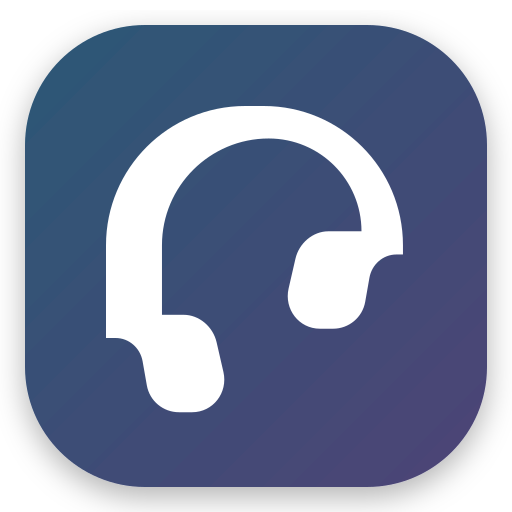

<p align="center">
  
</p>

<h1 align="center">CantoSync</h1>

<p align="center">
  <strong>A modern, high-performance audiobook player for Windows and Linux.</strong>
</p>

<p align="center">
  
  
  
  
</p>

---

## 📖 About CantoSync

**CantoSync** is designed with a focus on aesthetics and functionality, bridging the gap between powerful audio engines and native user experiences. It provides an industry-leading playback experience for audiobook enthusiasts.

---

## ✨ Key Features

| Feature | Description |
| :--- | :--- |
| 🚀 **High-Performance** | Powered by `media_kit` (libmpv) for unmatched stability and format support (M4B, MP3, FLAC, OPUS, and more). |
| 🔖 **Native Chapters** | Direct interface with the audio engine to parse embedded chapters (ID3/M4B) for easy navigation. |
| 🧠 **Smart Resume** | Remembers the exact second where you left off for *every* audio file in your library. |
| 📑 **Bookmarks** | Save custom timestamps to quickly jump back to important moments in your audiobooks. |
| 📚 **Series Support** | Organize audiobooks by series with automatic index-based ordering. |
| 📂 **Multiple Libraries** | Add multiple folder paths to build your complete audiobook collection. |
| 🎨 **Fluent Design** | A beautiful interface built with `fluent_ui`, featuring Mica and Acrylic effects on Windows. |
| 🎵 **Mini-Player** | Persistent mini-player with playback controls that stays visible across all screens. |
| 📊 **Listening Statistics** | Track your listening habits with daily stats, author analytics, and completion tracking. |
| 📝 **Metadata Editor** | Edit book titles, authors, descriptions, and custom cover art directly in the app. |
| 🎚️ **Equalizer** | Built-in audio equalization to customize your listening experience. |
| 🧹 **Orphaned File Cleaner** | Scan & purge database records for missing or deleted audio files automatically. |
| 🔄 **Auto-Updater** | Built-in update checker that automatically notifies you of new releases. |

---

## 📸 Screenshots

<div align="center">
  
  
  <br/><br/>
  
  
</div>

---

## 🛠️ Tech Stack

- **Framework**: [Flutter](https://flutter.dev)
- **UI Library**: [fluent_ui](https://pub.dev/packages/fluent_ui)
- **Audio Engine**: [media_kit](https://pub.dev/packages/media_kit) (libmpv)
- **State Management**: [Riverpod](https://riverpod.dev) & [flutter_hooks](https://pub.dev/packages/flutter_hooks)
- **Database**: [Isar Community](https://pub.dev/packages/isar_community)
- **OS Controls**: [audio_service](https://pub.dev/packages/audio_service) (Windows SMTC & Linux MPRIS)
- **Metadata Extraction**: [metadata_audio](https://pub.dev/packages/metadata_audio)
- **Image & Data Caching**: [cached_network_image](https://pub.dev/packages/cached_network_image) & [flutter_cache_manager](https://pub.dev/packages/flutter_cache_manager)
- **Window Management**: [window_manager](https://pub.dev/packages/window_manager)
- **Global Hotkeys**: [hotkey_manager](https://pub.dev/packages/hotkey_manager)
- **System Tray**: [tray_manager](https://pub.dev/packages/tray_manager)
- **File Picker**: [file_picker](https://pub.dev/packages/file_picker)
- **Layout & Utilities**: [gap](https://pub.dev/packages/gap), [fpdart](https://pub.dev/packages/fpdart), [fast_immutable_collections](https://pub.dev/packages/fast_immutable_collections)

---

## 🚀 Getting Started

### Prerequisites
- **Flutter SDK** (3.10+)
- **Visual Studio Build Tools** (Windows)
- **MPV dependencies** (Linux)

### Quick Start

```bash
# 1. Clone the repository
git clone https://github.com/SV-stark/CantoSync.git

# 2. Install dependencies
cd CantoSync
flutter pub get

# 3. Run the app
flutter run -d windows # or linux
```

---

## 📦 Installation

### Windows

#### Option 1: Download Pre-built Release
1. Download the latest release from [GitHub Releases](https://github.com/SV-stark/CantoSync/releases)
2. Run the `.exe` installer
3. Launch CantoSync from the Start Menu or Desktop shortcut

#### Option 2: Build from Source
```bash
flutter build windows --release
```
The executable will be at `build/windows/x64/runner/Release/`

### Linux

#### Option 1: Download Pre-built Release
1. Download the latest AppImage from [GitHub Releases](https://github.com/SV-stark/CantoSync/releases)
2. Make it executable: `chmod +x cantosync-*.AppImage`
3. Run: `./cantosync-*.AppImage`

#### Option 2: Build from Source
```bash
flutter build linux --release
```

---

## 🗺️ Roadmap

- [x] **High-Performance Audio Engine**: Powered by libmpv for native M4B/M4A support.
- [x] **Native Chapter Navigation**: Direct interface for embedded chapter markers.
- [x] **Smart Library Management**: Recursive folder scanning and metadata extraction.
- [x] **Visual Grid View**: Elegant cover-art-first library layout.
- [x] **Information & Context**: Detailed info screens with description & custom cover overrides.
- [x] **Integrated Sleep Timer**: Advanced auto-pause (timed or end-of-chapter).
- [x] **System Integration**: Global hotkeys, Tray control, and Window state persistence.
- [x] **Bookmarks**: Save and navigate to custom timestamps.
- [x] **Series Support**: Organize books by series with index ordering.
- [x] **Listening Statistics**: Track daily stats, author analytics, and completion rates.
- [x] **Mini-Player**: Persistent playback controls across all screens.
- [x] **Metadata Editor**: Edit titles, authors, descriptions, and cover art.
- [x] **Equalizer**: Built-in audio equalization.
- [x] **Auto-Updater**: Automatic update checking and notifications.
- [ ] **Cloud Sync**: Cross-device progress synchronization (NextCloud/WebDAV).
- [ ] **Audio DSP**: Per-file equalizer presets and playback rate optimization.
- [ ] **Smart Filters**: Dynamic grouping and advanced library search.

---

<p align="center">
  Made with ❤️ by <a href="https://github.com/SV-stark">SV-Stark</a>
</p>
